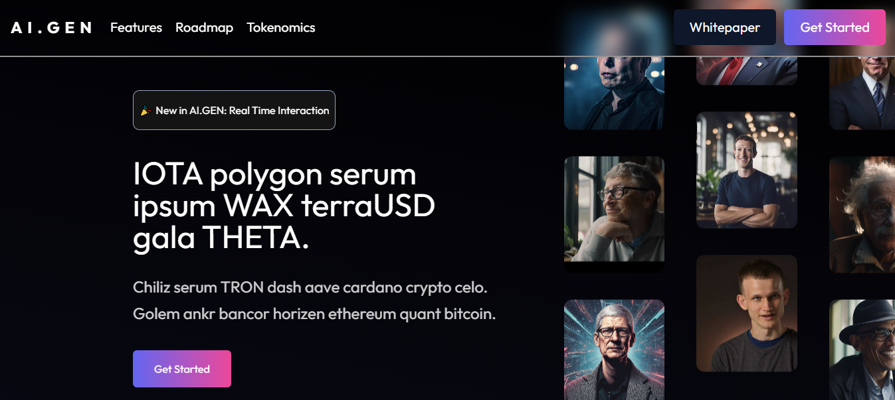

# Matrix-Lab-Assignment


<h2>Project Overview : </h2>
 This repository hosts the implementation of a landing page derived from a Figma design for the AI.Gen platform. The AI.Gen landing page is crafted to highlight the platform's features and capabilities through a well-structured layout. It includes several distinct sections:

<h2>Deployed Link: </h2>  https://ravi-mishra-frontend-developer.vercel.app/


 ## Project Type
- **Frontend**


## Directory Structure

```

Ravi-Mishra---Frontend-Developer
|
└── figma_design/
│   ├── .eslintrc.cjs
│   ├── .gitignore
│   ├── README.md
│   ├── index.html
│   ├── package-lock.json
│   ├── package.json
│   ├── postcss.config.js
│   ├── public/
│   │   
│   ├── src/
│   │   ├── assets/
│   │   │   └── react.svg
│   │   ├── components/
│   │   │   ├── Avatar.jsx
│   │   │   ├── Footer.jsx
│   │   │   ├── GetStarted.jsx
│   │   │   ├── Header.jsx
│   │   │   ├── ItemSection.jsx
│   │   │   ├── Navbar.jsx
│   │   │   ├── RoadMaps.jsx
│   │   │   ├── RoadMapOne.jsx
│   │   │   ├── RoadMapTwo.jsx
│   │   │   ├── RoadMapThree.jsx
│   │   │   ├── Technologies.jsx
│   │   │   ├── TextSection.jsx
│   │   │   └── Tokenomics.jsx
│   │   │
│   │   ├── styles/
│   │   │    ├── avatar.css
│   │   │    ├── footer.css
│   │   │    ├── getStarted.css
│   │   │    ├── itemSection.css
│   │   │    ├── navbar.css
│   │   │    ├── RoadMap.css
│   │   │    ├── technologies.css
│   │   │    ├── textSection.css
│   │   │    └── tokenomics.css
│   │   ├── App.css
│   │   ├── App.jsx
│   │   ├── main.jsx
│   │   └── index.css
│   │  
│   ├── .eslintrc.cjs
│   ├── .gitignore
│   ├── index.html
│   ├── package.lock.json
│   ├── package.json
│   ├── postcss.config.js
│   ├── tailwind.config.js
│   └── vite.config.js
└── README.md

```


## Features

- **Navbar**: The navigation bar provides easy access to different parts of the landing page.
- **Hero Section**: A visually engaging hero section that introduces the platform.
- **Introduction Section**: This section offers a brief overview of AI.Gen and its purpose.
- **How It Works**: Detailed information on how the platform operates.
- **Keywords Carousel**: A dynamic carousel showcasing key terms related to AI.Gen.
- **Tokenomics**: An explanation of the platform's economic model.
- **Roadmap**: A timeline outlining the development and future plans of AI.Gen.
- **Footer**: The footer contains additional links and information for users.


## Screenshots




## Key Features
1. **React**: Leveraging React for building interactive UIs and  enhancing code quality and maintainability.
2. **Tailwind CSS**: Utilizing Tailwind CSS to ensure rapid and consistent styling across the application.
3. **Scroll Animations & Transitions**: Integrating smooth scroll animations and transitions to enhance user experience.
4. **Card Animations**: Adding dynamic card animations to create engaging interactive elements.
5. **Responsiveness**: Ensuring the application is fully responsive for optimal user experience across various devices and screen sizes.

## Objectives
- **Accurate Implementation**: Faithfully translating the Figma design into a working web application.
- **Visual Integrity**: Maintaining the visual aesthetics and design consistency throughout the application.
- **Performance Optimization**: Ensuring smooth performance of animations and transitions on different devices and browsers.
- **User-Friendly Experience**: Creating an intuitive and seamless user experience with interactive elements and easy navigation.

## Technologies Used
- **React**: For building reusable and interactive UI components.
- **Tailwind CSS**: For utility-first CSS styling.
- **Custom CSS**: For utility-first CSS styling.


## Installation

1. Clone the repository to your local machine:

```bash
https://github.com/ravimishra007/Ravi-Mishra---Frontend-Developer.git
```

2. Navigate to the project directory:

```bash
cd Ravi-Mishra---Frontend-Developer
```

3. Install dependencies:

```bash
npm install
```

4. Run the application in development mode:

```bash
npm run dev
```
